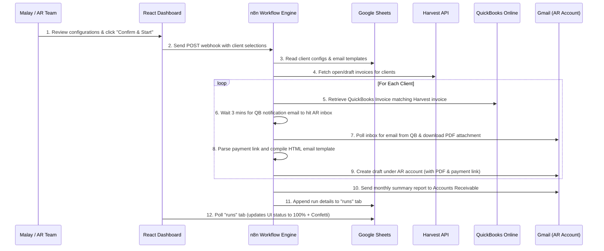

# DotcomWeavers Invoice Automation — Operations & Workflow Guide

This guide explains how to operate, configure, and troubleshoot the **DotcomWeavers Invoice Automation System**. 

The system automates the manual effort of drafting monthly support and commission invoices by connecting **Harvest**, **QuickBooks Online**, **Google Sheets**, and **Gmail** via an **n8n orchestration workflow** and a **React dashboard**.

---

## 1. System Overview & Architecture

The following diagram illustrates how the components interact during a run:

---

## 2. Google Sheets Configuration (The Data Source)

All data is driven by a single Google Spreadsheet (Spreadsheet ID: `1GFZbTMRpLQngThlif3BeCtIMubBEZiS-ZDXepm_EtZ4`). This spreadsheet contains three essential tabs that you and the AR team must manage.

### Tab 1: `read` (Client Configuration)
This tab lists all clients who are eligible for automated invoices.

| Column | Description | Accepted Values / Example |
| :--- | :--- | :--- |
| **client_name** | Must match the client name in Harvest and QuickBooks **exactly** (case-insensitive, but spelling must be identical). | `Bogush Inc.` |
| **ar_email** | The accounts receivable email of the client. Defaults to your AR email if blank. | `accountsreceivable@dotcomweavers.com` |
| **payment_method** | The preferred payment method. Used by the dashboard as a default. | `bank`, `credit card`, or `both` |
| **manual_attachment_required** | Flags if the client requires manual attachments (e.g. timesheets) before sending. | `yes` or `no` |

### Tab 2: `emails` (Email Templates)
This tab defines the custom email templates for each company.

| Column | Description | Example / Syntax |
| :--- | :--- | :--- |
| **company_name** | Must match the client name in the `read` tab **exactly**. | `Bogush Inc.` |
| **to** | Primary recipient email(s). Separate multiple emails with commas. | `malay@dotcomweavers.com` |
| **cc** | Copy recipient email(s). | `malay@dotcomweavers.com` |
| **bcc** | Blind copy recipient email(s). | `asgar@dotcomweavers.com` |
| **subject** | The subject line of the email. | `June Support Invoice \| Bogush Inc.` |
| **message** | The body of the email. You can type text with normal line breaks. | See formatting below |
| **manual_attachment** | Backup flag to indicate manual attachment requirement. | `yes` or `no` |

> [!TIP]
> **Email Message Formatting:**
> When writing the email body in the `message` column, you can press `Alt + Enter` (on Excel/Sheets) to insert line breaks.
> The n8n workflow automatically translates:
> - **Single line breaks** into HTML break tags (` `)
> - **Double line breaks** (blank lines) into paragraph spacing (`

`)

### Tab 3: `runs` (Run Logs)
*This tab is automated; you do not need to edit it.* The n8n workflow appends a row here at the end of each run to record:
- `date`: Execution timestamp.
- `month`: Billing month (e.g., "June 2026").
- `triggered_by`: Who initiated the run (e.g., `malay@dotcomweavers.com` or `Schedule (Auto)`).
- `clients_processed`: Pipe-separated list of client names processed.
- `client_count`: Total clients in the run.
- `total_amount`: Total dollar amount of invoices processed.
- `status`: Completion status (`completed` or `failed`).
- `execution_id`: The n8n execution ID (for troubleshooting).

---

## 3. Step-by-Step Operations Guide for Malay

Follow these steps each month to run the invoice automation:

### Step 1: Prep and Audit Google Sheets
Before opening the app, make sure:
1. All client details in the `read` sheet are correct.
2. The `emails` sheet contains templates for any new clients.
3. The client names match their names in QuickBooks and Harvest.

### Step 2: Open the React Dashboard
1. Navigate to the web application.
2. The app automatically fetches the latest configuration from Google Sheets.
3. If you just made changes to the Google Sheet, click the **Refresh** button on the client list to force-clear the cache.

### Step 3: Select Clients & Review Options
On the dashboard:
1. Review the list of clients loaded.
2. Check the **Select** box for the clients you want to run.
3. Review the **Payment Method** dropdown for each client (you can change this on the fly; changes apply to this run only).
4. Look out for the **Duplicate Run Warning** (a warning badge appears if an invoice draft was already created for that client during the current month).

### Step 4: Trigger the Workflow
1. Click the **Run Invoice Automation** button.
2. A confirmation modal will appear. It lists all selected clients, counts, and total amount.
3. If everything looks correct, click **Confirm & Start**.

### Step 5: Monitor the Run
Once started, the **Run Status Panel** will activate:
1. **Asymptotic Progress Bar:** The progress bar starts fast and gradually slows down, approaching 98% based on estimated duration (~40s per client).
2. **Client Progress Cards:** You will see each client transition through status steps:
   - `Waiting in queue...` (Pending)
   - `Getting payment link from QuickBooks...` (Finding QB Invoice ID)
   - `Merging and saving drafts...` (Interacting with Gmail AR Inbox, downloading PDF, generating HTML email content)
   - `Draft created successfully` (Draft is ready in your Gmail)
3. **Real-time Completion:** Once n8n finishes all drafts and appends the completion row to the `runs` tab, the UI detects the new record, jumps to **100%**, and triggers a **Success Confetti** animation.

---

## 4. Gmail Review & Sending Drafts (Crucial Step)

The automation **never** sends emails directly to clients. It only creates **Drafts** under the **accountsreceivable@dotcomweavers.com** Gmail account. 

After the run finishes, Malay or the AR team must:

1. Log into the **AR Gmail account**.
2. Go to the **Drafts** folder.
3. For each drafted invoice email, review the following:
   
   #### A. Check for `[ADD ATTACHMENT]` Prefix in Subject
   - If the subject is prefixed with `[ADD ATTACHMENT]` (e.g. `[ADD ATTACHMENT] June Support Invoice | All Parts...`), it means the client configuration had `manual_attachment_required` set to `yes`.
   - **Action:** Retrieve the client's timesheet or work log, attach it to the email, and **delete** the `[ADD ATTACHMENT]` prefix from the subject line.
   
   #### B. Review the Email Design & Link
   - The email contains a premium HTML layout with the DotcomWeavers logo and a green **View and Pay** button.
   - Click the button to ensure it opens the QuickBooks online payment page.
   - If the payment link was not found by n8n, you will see a red text warning: `Pay link not found - add manually`. In this case, log into QuickBooks, copy the payment link, and paste it into the email before sending.
   
   #### C. Verify Attachments
   - Verify that the QuickBooks PDF invoice is attached to the draft.
   
   #### D. Check Recipients
   - Confirm that the `To`, `Cc`, and `Bcc` fields match your expectations.
   
4. Once verified, click **Send**.

---

## 5. Troubleshooting & FAQs

### Q1: The progress panel shows a timeout or remains stuck at 98%.
- **Reason:** The n8n workflow might have errored out or took longer than 6 minutes.
- **Action:** 
  1. Open n8n and look at the execution logs using the `execution_id` from the dashboard's History tab.
  2. Check if the Gmail or QuickBooks credentials expired.
  3. Go to Gmail and check if drafts were created anyway. If they were, you can send them manually.

### Q2: An email draft was created, but it says "Pay link not found - add manually".
- **Reason:** The workflow parses the QuickBooks notification email HTML to find the link. If QuickBooks changed its email format or the notification email was not received, the link extractor fails.
- **Action:** Find the invoice in QuickBooks, copy the link, and paste it into the draft email.

### Q3: No PDF was attached to the Gmail draft.
- **Reason:** The workflow waits 3 minutes for QuickBooks to deliver the notification email to your AR inbox. If QuickBooks is slow, or if the email was archived/marked as read, n8n won't find it.
- **Action:** 
  1. Download the PDF from QuickBooks.
  2. Open the Gmail draft, click the paperclip icon, and attach the PDF manually.

### Q4: How does the automatic monthly schedule work?
- The workflow has a `Monthly — 1st at 9AM` trigger.
- On the 1st of the month, n8n automatically reads the `read` sheet configurations, fetches open invoices from Harvest, generates QuickBooks lookups, processes PDF extraction, and writes drafts for **all active clients** in the configuration sheet.
- A summary report email is sent to `accountsreceivable@dotcomweavers.com` to notify you that the drafts are ready for review.
- The run is logged in the `runs` sheet under `triggered_by = Schedule (Auto)`.

### Q5: How do I change client details permanently?
- Simply open the Google Sheet, modify the respective columns in `read` or `emails` tabs, and then refresh the React dashboard. No code changes or n8n deployments are needed.
