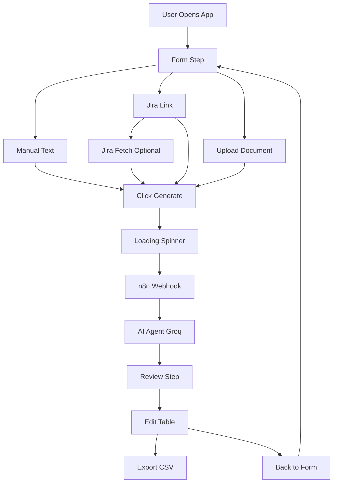
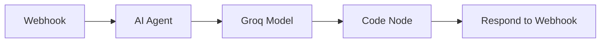
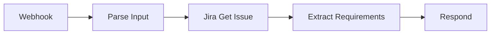
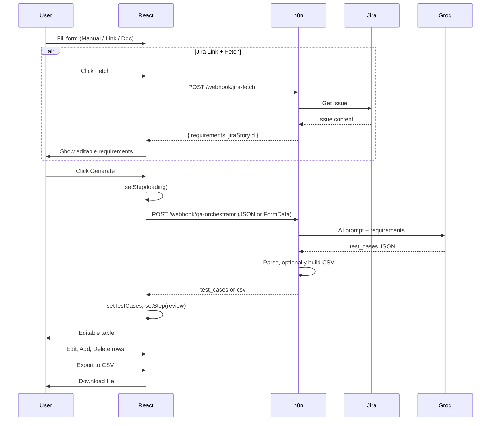

# QA Automation Orchestrator — End-to-End Workflow

Complete flow from user action to exported test cases.

---

## 1. User Journey Overview



---

## 2. Form Step — Field Order & Input Methods

### 2.1 Form Layout (Top to Bottom)

1. **Project Metadata**
   - Domain (select: E-commerce, B2B Portal, SaaS)
   - Platform (select: Magento, Shopify, Custom Web)

2. **Input Method** (choose one)
   - **Manual Text** — paste requirements in a textarea
   - **Jira Link** — paste Jira issue URL, optionally fetch requirements
   - **Upload Document** — drag/drop or upload PDF, DOC, DOCX

3. **Jira Story ID** (required)
   - Auto-filled when pasting Jira link (e.g. AC-515 from `.../browse/AC-515`)

4. **Additional Notes** (optional)

5. **Generate Test Cases** button

### 2.2 Input Method Flows

| Method | User Action | Data Sent |
|--------|-------------|-----------|
| Manual Text | Paste requirements in textarea | `Requirements` = pasted text |
| Jira Link | Paste URL, optionally click Fetch | `Jira Link` = URL; if fetched, `Requirements` = extracted text |
| Document | Upload file | FormData with `file` + metadata |

---

## 3. Jira Link — Optional Fetch Flow

When **Jira Link** is selected:

1. User pastes URL (e.g. `https://dotcomweavers.atlassian.net/browse/AC-515`)
2. App auto-extracts **Jira Story ID** (AC-515) and fills the field
3. User clicks **Fetch** (or n8n `jira-fetch` is called)
4. `POST /webhook/jira-fetch` with:
   ```json
   { "Jira Link": "https://...", "Jira Story ID": "AC-515" }
   ```
5. n8n fetches issue from Jira API, extracts description + acceptance criteria
6. Response: `{ "requirements": "...", "jiraStoryId": "AC-515" }`
7. App shows **Fetched Requirements** in an editable textarea
8. User can edit before clicking **Generate**

---

## 4. Submit — Request to n8n

### 4.1 Manual Text or Jira Link (JSON)

```
POST /webhook/qa-orchestrator
Content-Type: application/json
```

**Payload:**
```json
{
  "Domain": "E-commerce",
  "Platform": "Magento",
  "Jira Story ID": "AC-515",
  "Notes": "Focus on security",
  "Input Method": "Manual Text",
  "Jira Link": "",
  "Requirements": "As a user I want to..."
}
```

For **Jira Link** (with fetched requirements):
```json
{
  "Domain": "E-commerce",
  "Platform": "Magento",
  "Jira Story ID": "AC-515",
  "Notes": "",
  "Input Method": "Jira Link",
  "Jira Link": "https://company.atlassian.net/browse/AC-515",
  "Requirements": "Description and acceptance criteria from Jira..."
}
```

For **Jira Link** (no fetch, n8n must extract):
```json
{
  "Input Method": "Jira Link",
  "Jira Link": "https://...",
  "Requirements": ""
}
```

### 4.2 Document Upload (FormData)

```
POST /webhook/qa-orchestrator
Content-Type: multipart/form-data
```

| Field | Value |
|-------|-------|
| Domain | E-commerce |
| Platform | Magento |
| Jira Story ID | AC-515 |
| Requirements | (notes/context) |
| Notes | Additional context |
| file | [binary PDF/DOC/DOCX] |

---

## 5. n8n Backend Flow

### 5.1 Main Workflow (qa-orchestrator)



| Step | Node | Action |
|------|------|--------|
| 1 | Webhook | Receives POST at `/webhook/qa-orchestrator` |
| 2 | AI Agent | Uses `$json.body.Domain`, `Platform`, `Jira Story ID`, `Requirements`, `Notes` |
| 3 | Groq | `openai/gpt-oss-120b` generates test cases |
| 4 | Code | Parses AI JSON, strips markdown, builds CSV |
| 5 | Respond | Returns `{ csv }` or `{ test_cases }` to client |

### 5.2 AI Prompt (simplified)

- Analyze requirements for `Platform` app in `Domain` domain
- Use `Requirements` (or `Notes`) as main input
- Return JSON: `{ "test_cases": [ {...}, {...} ] }`

### 5.3 Jira Fetch Workflow (jira-fetch) — Optional



- Receives `{ "Jira Link", "Jira Story ID" }`
- Fetches issue via Jira API
- Returns `{ "requirements": "...", "jiraStoryId": "..." }`

---

## 6. Response Handling (React App)

App accepts any of:

| Format | Example |
|--------|---------|
| JSON array | `[{ "ID": "SMK-001", ... }]` |
| `test_cases` | `{ "test_cases": [...] }` |
| `data` | `{ "data": [...] }` |
| `csv` | `{ "csv": "ID,...\nSMK-001,..." }` |
| Raw CSV | `ID,"Test case Title"...` |

Parsed into `testCases` state with keys: `ID`, `Test case Title`, `Test Step`, `Test Data`, `Expected Result`, `Jira id`.

---

## 7. Review Step

1. **Loading** → Spinner: "Analyzing requirements and generating test cases..."
2. **Review** → Editable table:
   - Columns: Actions, ID, Test case Title, Test Step, Test Data, Expected Result, Jira id
   - Editable cells: all except Actions
   - Delete row (Trash icon)
   - Add Row button at bottom
3. **Action bar:**
   - **Export to CSV** — client-side CSV download
   - **Back to Form** — clears state, returns to form
   - **Submit Final Cases** — logs JSON to console (Jira/TestRail integration placeholder)

---

## 8. Export to CSV

- Converts `testCases` to CSV with proper quoting
- Triggers download: `test_cases_{jiraStoryId}.csv`
- Success toast

---

## 9. Complete Data Flow Diagram



---

## 10. Environment Variables

| Variable | Purpose |
|----------|---------|
| `VITE_WEBHOOK_URL` | Main webhook (e.g. `https://hr.n8n.dcw.dev/webhook/qa-orchestrator`) |
| `VITE_JIRA_FETCH_URL` | Jira fetch webhook (e.g. `https://hr.n8n.dcw.dev/webhook/jira-fetch`) |

---

## 11. Validation Rules

| Rule | When |
|------|------|
| Jira Story ID required | Always |
| Manual text required | Input method = Manual Text |
| Jira link required | Input method = Jira Link |
| Document required | Input method = Upload Document |

---

## 12. Error Handling

- **Form validation** — inline error message (red box)
- **Fetch failure** — error under Jira link input + toast
- **Webhook failure** — error message, stay on form
- **Toast** — success/error, auto-dismiss after 4s

---

## 13. Quick Reference — Payload by Input Method

| Input Method | Input Method | Jira Link | Requirements |
|--------------|--------------|-----------|--------------|
| Manual Text | `"Manual Text"` | `""` | Pasted text |
| Jira Link (fetched) | `"Jira Link"` | Full URL | Fetched + edited text |
| Jira Link (not fetched) | `"Jira Link"` | Full URL | `""` (n8n must fetch) |
| Document | N/A (FormData) | N/A | Notes value |

---

## 14. Files Reference

| File | Purpose |
|------|---------|
| `src/App.tsx` | React app, form, review table, webhook calls |
| `n8n.json` | QA Orchestrator n8n workflow (test case generation) |
| `vite.config.ts` | Proxy `/webhook` → n8n in dev |
| `WORKFLOW.md` | Detailed API docs, request/response formats |
